# FINAL AUDIT REPORT – Challengr iOS

**Gegenstand:** `Swift/Challengr` (Haupt-App), Commit `8eccb7f`, inkl. der für die App relevanten Backend-Schnittstellen
**Datum:** 30.09.2026 · **Umgebung:** Xcode 26.0.1, iOS-26.0-Simulator (iPhone 17 Pro, iPhone 16e, iPad Pro 11")
**Teilberichte:** [SYSTEM_MAP](SYSTEM_MAP.md) · [SWIFT_CODE_AUDIT](SWIFT_CODE_AUDIT.md) · [BUILD_AND_TEST_RESULTS](BUILD_AND_TEST_RESULTS.md) · [GAMEPLAY_TEST_REPORT](GAMEPLAY_TEST_REPORT.md) · [USABILITY_UX_REPORT](USABILITY_UX_REPORT.md) · [PERFORMANCE_REPORT](PERFORMANCE_REPORT.md) · [BUG_REPORT](BUG_REPORT.md) · [IMPROVEMENT_ROADMAP](IMPROVEMENT_ROADMAP.md) · [TEST_MATRIX](TEST_MATRIX.md) · [EXECUTION_LOG](EXECUTION_LOG.md)

---

## 1. Executive Summary

Challengr ist eine SwiftUI-App für standortbasierte Real-Life-Duelle mit Quarkus-Backend. Ich habe die App **wirklich gebaut, gestartet und bedient**:
- **42 eigene UI-Testmethoden** in 50 Läufen, mit echten Mitspielern über WebSocket
- 47 vorhandene Unit-Tests und 75 Backend-Tests
- automatischer Accessibility-Audit auf 9 Screens
- Messungen mit XCTMetric, `leaks` und Instruments
- 95 echte Screenshots als Beleg

**Das Positive:** Die Kernschleife funktioniert. Anfrage → Annahme → Battle → Abstimmung/Messung → Ergebnis → Punkte lief für normale Battles, Wissen und Sprint in der App fehlerfrei durch. Der ursprüngliche Hauptfehler (Spieler 2 bekommt eine andere Challenge) ist **nachweislich behoben** (GP05). Weitere Ergebnisse:
- **kein einziger Absturz**
- **0 Speicherlecks**
- **0 Hang-Risiken**
- im Leerlauf ≈ 0,1 % CPU

**Das Kritische:**
1. **Sicherheit (kritisch):** Die App schickt nie einen Auth-Token, und das Backend verlangt keinen. Lokal bestätigt: fremde Spieler lassen sich umbenennen und versetzen, alle Positionen sind lesbar, die Admin-/Ban-API ist offen.
2. **Spielentscheidende Fehler (hoch), in der App reproduziert:**
   - Eine Anfrage eines Dritten kapert das laufende Battle.
   - Das Wissens-Battle hängt, wenn beide falsch antworten.
   - Nach einem App-Neustart wird die Annahme der eigenen Anfrage ignoriert.
3. **Darstellung (hoch):**
   - Dark Mode ist unbrauchbar, weil alle Markenfarben weiß werden.
   - Es gibt kein App-Icon.
   - Der Battle-Screen läuft auf iPhones über den Rand.
   - Der Accessibility-Audit meldet 218 Befunde.

**Freigabe-Einschätzung:** **Nicht release-reif** für eine öffentliche Veröffentlichung. Für einen **begleiteten Schultest** ist sie nach Behebung von 6 kleinen P0/P1-Punkten vertretbar, vorausgesetzt, das Sicherheitsrisiko wird bewusst akzeptiert (Abschnitt 14).

| Kennzahl | Wert |
|---|---|
| Testfälle in der Matrix | **72 ausgeführt**: **42 PASS**, **30 FAIL** · **9 BLOCKED** · **8 NOT TESTED** |
| Automatisierte Einzeltests (Repo) | 47/47 App-Unit · 75/75 Backend |
| Bestätigte Bugs | **20** (1 kritisch, 5 hoch, 7 mittel, 7 niedrig) |
| Code-Abdeckung App | 3,9 % |
| Accessibility-Audit | 218 Befunde auf 9 Screens |
| Abstürze / Leaks / Hänger | 0 / 0 / 0 |

## 2. Untersuchungsumfang und Testumgebung

| | |
|---|---|
| Hardware/OS | Mac, macOS 15.7.3 |
| Werkzeuge | Xcode 26.0.1, XCTest/XCUITest, `performAccessibilityAudit`, XCTMetric, `leaks`, `xctrace` (Time Profiler), `simctl` |
| Geräte | iPhone 17 Pro (Hauptgerät), iPhone 16e (klein), iPad Pro 11" – alle **iOS 26.0** (einzige verfügbare Laufzeit) |
| Backend | lokale Kopie des Repo-Backends (Quarkus-Dev, H2, Testdaten) |
| Mitspieler | Node-Skript mit echten WebSocket-Verbindungen |
| Nicht verfügbar | echtes iPhone, Keycloak-Testkonto, iOS < 26, SwiftLint |

**Vorgehen:** Am Repository wurde **nichts geändert** (nur `docs/audit/` angelegt). Für die UI-Tests lief ein **isolierter Klon** mit drei dokumentierten Test-Eingriffen: Backend-URL aus Umgebungsvariable, Test-Login statt Keycloak, HTTP zu `localhost` erlaubt. Dazu kam ein UI-Test-Target. Alles nach dem Login ist Original-Code ([EXECUTION_LOG §2.8](EXECUTION_LOG.md)). Gegen die Produktivumgebung wurde nichts ausgeführt.

## 3. Überblick über Spiel und Architektur

- **SwiftUI**, keine Game Engine, keine Drittabhängigkeiten, iOS 17.6+, iPhone + iPad
- **9 Battle-Typen:** normales Battle mit Abstimmung, Wissen, 7 Sensor-Challenges (Sprint, Check-In, Kompass, Shake, Lautstärke, Kamera, Liegestütze/ARKit)
- **Zentraler Zustand in `MapView`** (1 676 Zeilen, ≈ 50 `@State`). Ereignisse kommen über Closure-Callbacks des `GameSocketService`. Reine Spielregeln liegen bereits in `Logic/` (100 % getestet).
- **Persistenz:** Spielstand ausschließlich serverseitig; lokal nur `UserDefaults` für Einstellungen.

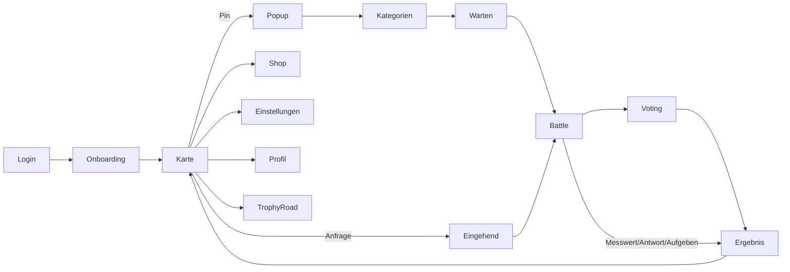

Details: [SYSTEM_MAP](SYSTEM_MAP.md).

## 4. Ergebnisse des Swift-Code-Audits

| Bereich | Wichtigste Befunde |
|---|---|
| Spiellogik | `currentBattleId` wird im Battle überschrieben (CA-01, **bestätigt**); Wissens-Battle ohne Ende (CA-02, **bestätigt**); Zustand geht bei Neustart verloren (CA-03, **bestätigt**); optimistisches Annehmen (CA-04); „Schließen“ ohne Aufgeben (CA-05) |
| Architektur | God-Object `MapView` (CA-10); toter Code (CA-11); drei Mechanismen für Freundschaftsanfragen (CA-12); Battle-Typ am Text erkannt (CA-14) |
| Concurrency | URLSession-Callbacks verändern MainActor-Zustand → Data-Race-Risiko (CA-19, 58 Strict-Meldungen); 1 Warnung wird in Swift 6 ein Fehler |
| Ressourcen | Standort ohne Filter, 3 parallele `CLLocationManager` (CA-13); Socket bleibt nach Logout offen (CA-21, **bestätigt**) |
| Fehlerbehandlung | HTTP-Status fast nie geprüft, Fehler nur `print` (CA-23 bis CA-25) |
| Crash-Risiken | nur 5 Force-Unwraps/-Casts, alle unkritisch |

## 5. Build- und Testergebnisse

| Prüfung | Ergebnis |
|---|---|
| Clean Build | ✅ 17 s, 12 Warnungen |
| Strict Concurrency | ✅ Build, 58 Meldungen |
| Unit-Tests App | ✅ 47/47, Abdeckung 3,9 % |
| Backend-Tests | ✅ 75/75 |
| UI-Tests (Audit) | 50 Läufe; 18 der 20 Bugs durch UI-Läufe belegt (BUG-01 per `curl`, BUG-17 statisch); 6 Testprobleme erkannt und korrigiert |
| CI | ❌ Platzhalter, führt keine Tests aus |

## 6. Tatsächlich überprüfte Gameplay-Funktionen

| Funktion | Ergebnis | Beleg |
|---|---|---|
| Onboarding, Überspringen, Persistenz | ✅ | GP01, GP02 |
| Karte, Spieler in der Nähe, Punkte | ✅ | GP03 |
| Herausfordern: Kategorien, Zufall, **gleicher Text beim Gegner** | ✅ | GP04, GP05 |
| Abbrechen, Ablehnen, Doppel-Tap | ✅ | GP06–GP09 |
| Normales Battle mit Abstimmung → Sieg, Punkte 200 → 230 | ✅ | GP10 |
| Aufgeben, Konflikt | ✅ | GP11, GP12 |
| Wissen: richtige Antwort | ✅ | GP13 |
| **Wissen: beide falsch** | ❌ hängt | GP14 |
| Sprint mit Messwerten | ✅ | GP15 |
| Ablauf nach 60 s | ✅ (64 s) | GP16 |
| **Dritter Spieler während Battle** | ❌ Battle gekapert | GP17 |
| Hintergrund, Mitteilung | ✅ | GP18, GP19 |
| **Neustart mit offener Anfrage / im Battle** | ❌ Zustand weg | FU01, FU02 |
| Shop, Einstellungen, Profil, Trophy Road, Freundschafts-Banner | ✅ | SC01, RT01–RT03, SC04 |
| Freunde-Seite ohne Standort, Offline, Popup schließen, Logout-Socket | ❌ | RT02, SC07, SC06, SC02 |

<table>
<tr>
<td align="center">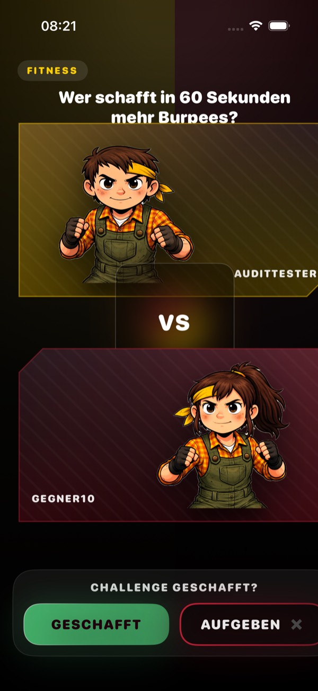 Battle (Überlauf rechts, BUG-08)</td>
<td align="center">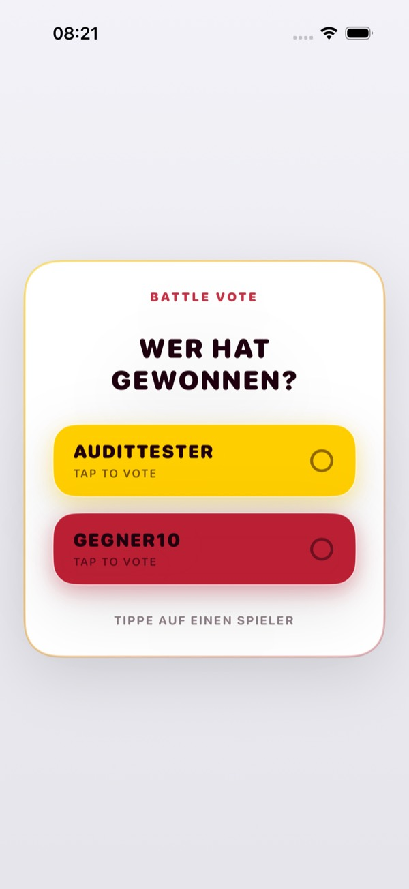 Voting (Kontrast, Englisch)</td>
<td align="center">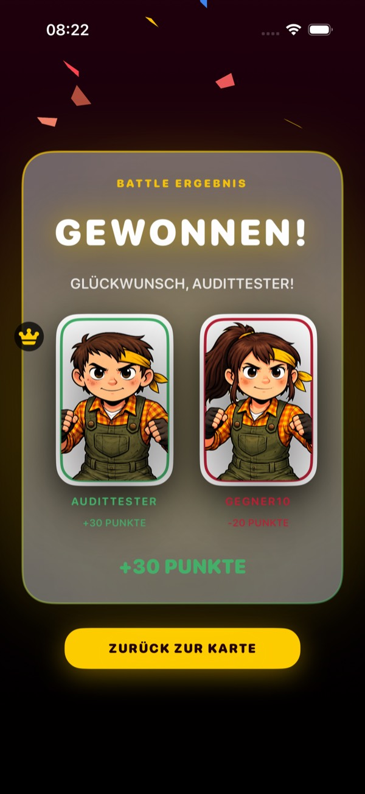 Sieg, +30 Punkte</td>
<td align="center">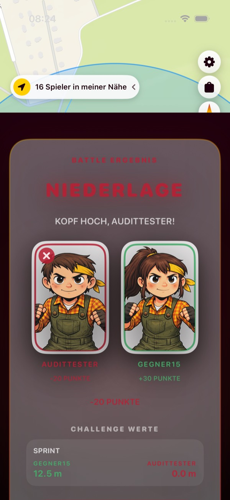 Sprint mit Messwerten</td>
</tr>
</table>

## 7. Usability- und UX-Ergebnisse

**Stärken:** klare Markensprache im hellen Modus, verständliches Onboarding, ausdrucksstarke Ergebnis-Screens, Banner für Ablehnung/Ablauf/Freundschaftsanfragen, zuverlässiger Doppel-Tap-Schutz.

**Wichtigste Mängel** (vollständig im [USABILITY_UX_REPORT](USABILITY_UX_REPORT.md)):

| # | Mangel | Schwere |
|---|---|---|
| 1 | Dark Mode: Markenfarben werden weiß → Texte und Buttons unsichtbar | hoch |
| 2 | Wissens-Battle ohne Rückmeldung nach falscher Antwort | hoch |
| 3 | Spiel steckt fest bei Anfrage eines Dritten bzw. nach Neustart | hoch |
| 4 | Battle-Screen läuft auf iPhones über den Rand | mittel |
| 5 | Keine Restzeit-Anzeige (60 s Anfrage, 45 s Warten) | mittel |
| 6 | Konflikt/Unentschieden wird als „Niederlage“ dargestellt | mittel |
| 7 | Offline: „0 Punkte“ ohne Hinweis | mittel |
| 8 | Freunde nur mit Standort; Popup nicht schließbar; Pins überlappen | mittel/niedrig |
| 9 | Kein Dynamic Type, VoiceOver-Labels sind Symbolnamen | mittel |

<table>
<tr>
<td align="center">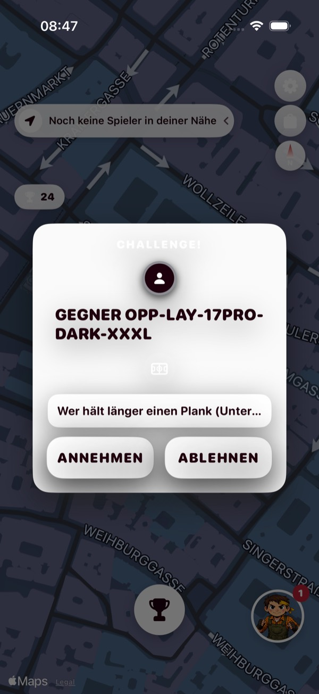 Dark Mode: „CHALLENGE!“ und Buttons weiß auf weiß</td>
<td align="center">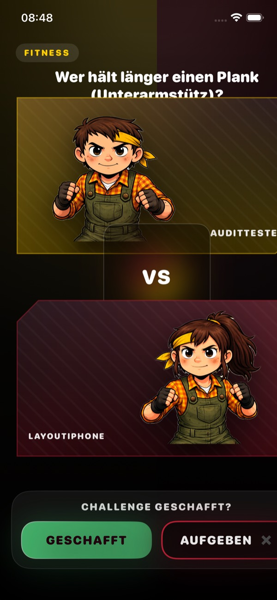 iPhone 16e: Titel verdeckt, rechts abgeschnitten</td>
<td align="center">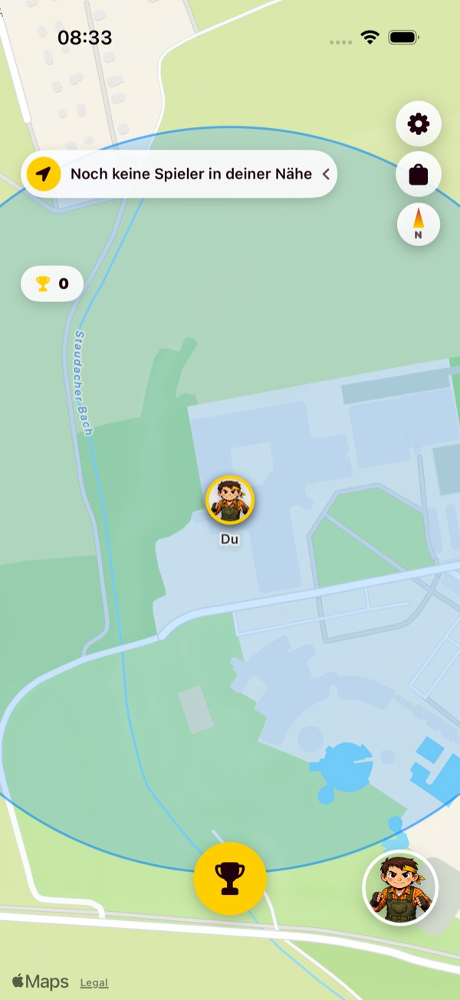 Offline: „0“ Punkte, kein Hinweis</td>
<td align="center">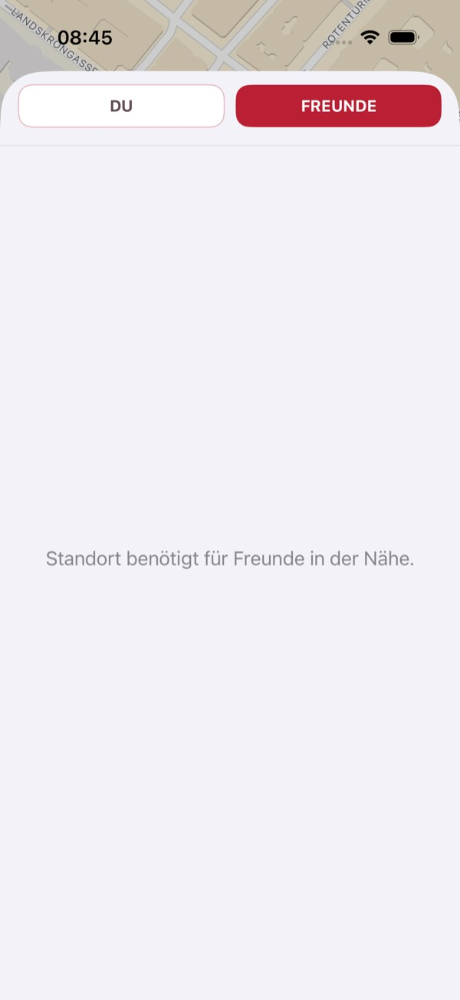 Freunde ohne Standort gesperrt</td>
</tr>
</table>

## 8. Screenshots der bestätigten Fehler

<table>
<tr>
<td align="center">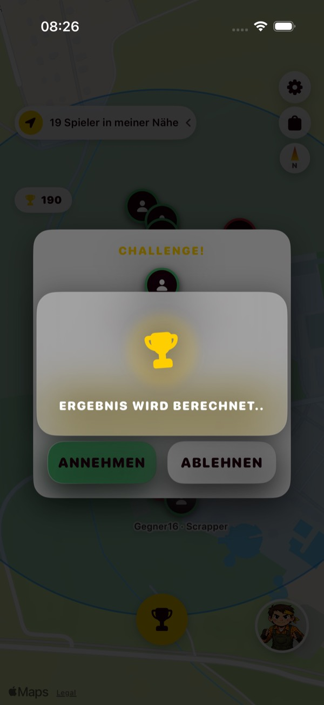 <b>BUG-02</b>: „Ergebnis wird berechnet“ über fremdem Popup – kommt nie</td>
<td align="center">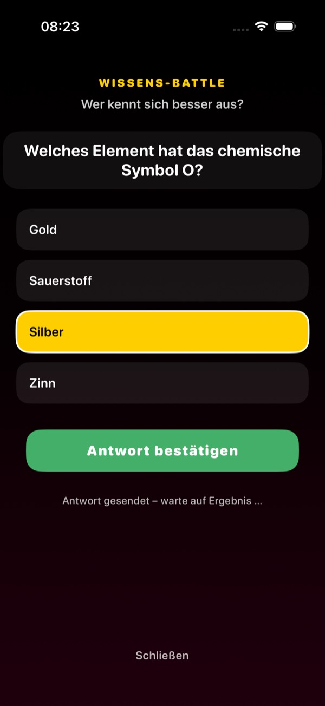 <b>BUG-03</b>: beide falsch – kein Ende</td>
<td align="center">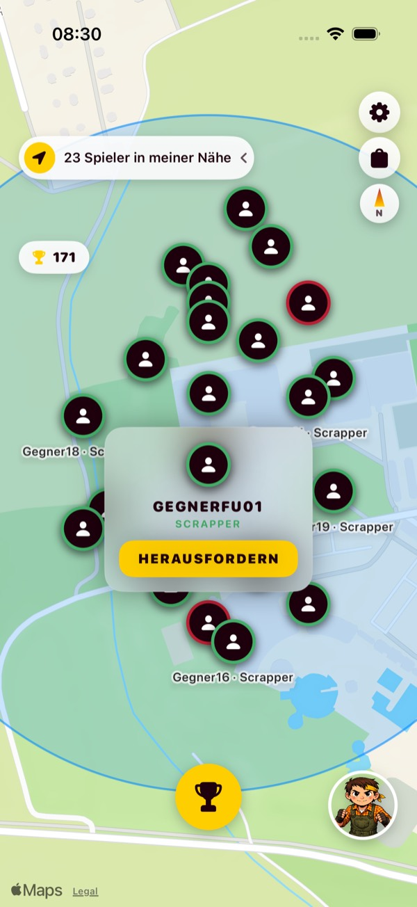 <b>BUG-05</b>: Gegner nahm an – App bleibt auf Karte</td>
<td align="center">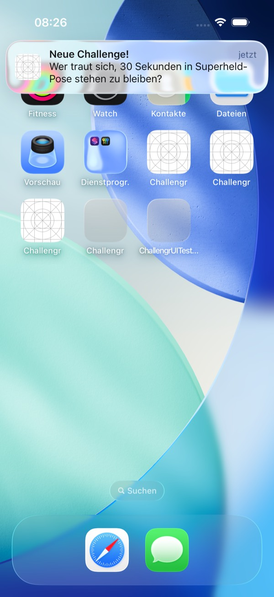 <b>BUG-07</b>: Platzhalter statt App-Icon</td>
</tr>
<tr>
<td align="center">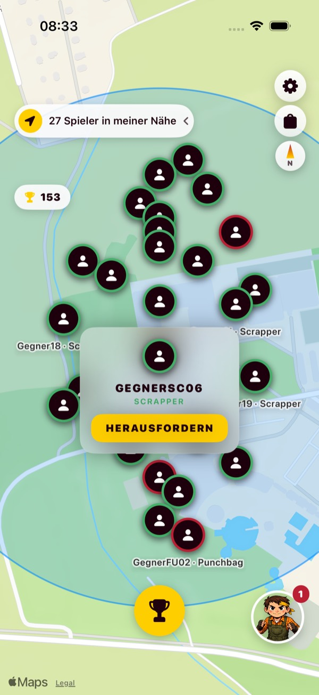 <b>BUG-12</b>: Popup bleibt nach Tippen daneben</td>
<td align="center">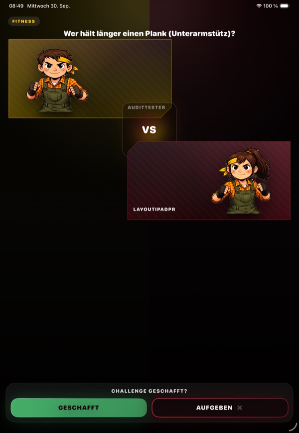 <b>BUG-16</b>: iPad-Layout nicht angepasst</td>
<td align="center">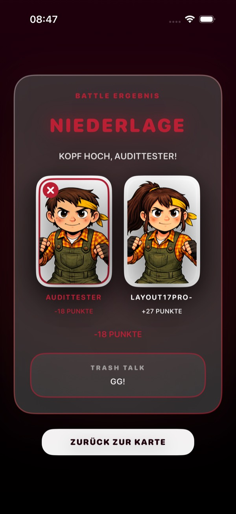 <b>BUG-04</b>: Button weiß, Name abgeschnitten</td>
<td align="center">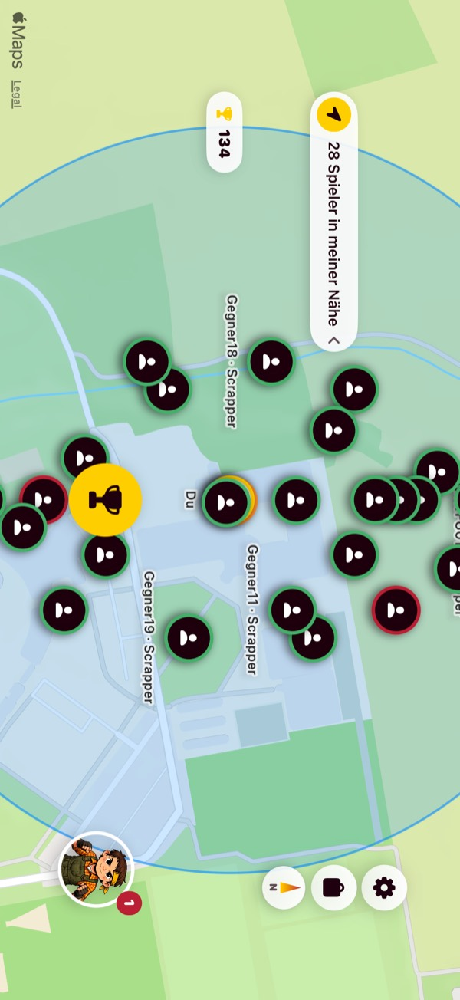 <b>BUG-16</b>: Querformat nicht gestaltet</td>
</tr>
</table>

## 9. Performance und Stabilität

| Messung | Ergebnis |
|---|---|
| App-Start (Simulator, Debug) | Ø **2,56 s** bis zum ersten reaktionsfähigen Frame |
| Speicher | ≈ 120 MB; wächst leicht (+0,4–0,75 MB pro Runde) |
| Leaks (`leaks`) | **0** |
| Time Profiler (15 s Leerlauf) | 16 Samples, **0 Hang-Risiken** |
| Abstürze | **0** in 50 UI-Läufen |

**Risiken aus dem Code** (nicht gemessen): Standort-Updates ohne Filter mit PUT bei jeder Änderung, Polling-Kaskade, Pin-Neuaufbau alle 4 s. Diese sind auf echten Geräten zu messen. Details: [PERFORMANCE_REPORT](PERFORMANCE_REPORT.md).

## 10. Sicherheit und Datenschutz

| Befund | Status |
|---|---|
| App sendet kein Token; Backend ohne Authentifizierung; Admin/Ban offen | **bestätigt (lokal) + statisch** – kritisch |
| Fremde Spieler umbenennen/versetzen, alle Positionen lesbar | **bestätigt (lokal)** – kritisch (Minderjährige in Schultests) |
| Richtige Wissens-Antworten über Dashboard-Endpunkt lesbar | **bestätigt (lokal)** |
| Ban-Prüfung per selbst gesendetem Header umgehbar | statisch |
| Messwerte ungeprüft (Schummeln per eigener WS-Verbindung) | statisch |
| CORS `*` mit Credentials; triviale Secret-Defaults | statisch |
| Logout erreicht SSO-Session vermutlich nicht | Hypothese (ohne Keycloak nicht prüfbar) |
| Lokale Speicherung | unkritisch (nur Einstellungen) |

## 11. Fehlerkatalog (Kurzfassung)

| Prio | Bugs |
|---|---|
| **kritisch** | BUG-01 Authentifizierung |
| **hoch** | BUG-02 Battle gekapert · BUG-03 Wissens-Battle hängt · BUG-04 Dark Mode · BUG-05 Neustart/Annahme ignoriert · BUG-07 kein App-Icon |
| **mittel** | BUG-06 Neustart im Battle · BUG-08 Battle-Layout · BUG-09 Socket nach Logout · BUG-10 Accessibility · BUG-11 Offline · BUG-13 Freunde ohne Standort · BUG-20 keine Rückmeldung (Wissen) |
| **niedrig** | BUG-12 Popup · BUG-14 Text gekürzt · BUG-15 ID statt Name · BUG-16 iPad/Querformat · BUG-17 Musik-Schalter · BUG-18 Tippfehler Rang · BUG-19 Avatar/Sprachmix |

Vollständig mit Reproduktionsschritten: [BUG_REPORT](BUG_REPORT.md).

## 12. Nicht getestete Bereiche und Einschränkungen

- **Echter Login/Logout über Keycloak** (kein Testkonto; Produktivsystem bewusst nicht berührt) → BLOCKED
- **Sensor-Challenges** Liegestütze (ARKit), Kamera, Kompass → BLOCKED im Simulator; Schrei, Shake, Check-In → NOT TESTED
- **Echte Geräte**, Energie, Framerate, iOS 17.6–25 → BLOCKED
- **VoiceOver manuell**, hörbare Sounds, Haptik → nur indirekt geprüft
- Charakter-Editor, Geschenke, AirDrop, Challenge-Katalog, Web-Dashboard → NOT TESTED
- Spielspaß und Frust → nur Hypothesen, **keine Nutzerstudie** ([USABILITY_UX_REPORT §G](USABILITY_UX_REPORT.md))

## 13. Handlungsempfehlungen (Roadmap-Kurzfassung)

| Sprint | Maßnahmen | Wirkung |
|---|---|---|
| **1 (sofort, ≈ 3 Tage)** | M-02 Battle-Schutz · M-03 Wissens-Ende · M-04 Dark-Mode-Farben · M-05 Icon · M-07 Logout-Aufräumen · M-10 Freunde ohne Standort | kein Festhängen, lesbar, präsentierbar |
| 2 | M-01 Authentifizierung (App + Backend + Dashboard) · M-12 CI mit Tests | sicher, abgesichert |
| 3 | M-06 Zustand nach Neustart · M-08 Battle-Layout · M-09 Offline-Anzeige · M-11 Anti-Schummeln | robust |
| 4 | M-14 Thread-Sicherheit · M-15 `BattleSession` aus `MapView` · M-16/17 Standort und Polling | wartbar, sparsam |
| 5+ | M-13 Accessibility · M-18–M-20 UX · P3-Aufräumen | zugänglich, verständlich |

Details mit Akzeptanzkriterien und Regressionstests: [IMPROVEMENT_ROADMAP](IMPROVEMENT_ROADMAP.md).

## 14. Release-Readiness

### 14.1 Release-Kriterien (vor der Bewertung festgelegt)

| # | Kriterium | Öffentlicher Release (App Store) | Begleiteter Schultest |
|---|---|---|---|
| RC-1 | Keine offenen kritischen Sicherheitsbefunde | Pflicht | Risiko dokumentiert und akzeptiert |
| RC-2 | Kern-Spielablauf ohne Festhängen (alle Battle-Typen) | Pflicht | Pflicht für die genutzten Typen |
| RC-3 | Keine Abstürze in den ausgeführten Tests | Pflicht | Pflicht |
| RC-4 | App-Icon und lesbare Darstellung in hell **und** dunkel | Pflicht | Pflicht (oder hell erzwungen) |
| RC-5 | Grundlegende Accessibility (Labels, Kontrast) | Pflicht | empfohlen |
| RC-6 | Test auf echten Geräten inkl. aller Sensor-Challenges | Pflicht | Pflicht für die genutzten Typen |
| RC-7 | Echter Login/Logout getestet | Pflicht | Pflicht |
| RC-8 | Automatisierte Tests in CI | empfohlen | optional |

### 14.2 Bewertung

| # | Status heute | Nachweis |
|---|---|---|
| RC-1 | ❌ nicht erfüllt | BUG-01 (lokal bestätigt) |
| RC-2 | ❌ nicht erfüllt | BUG-02, BUG-03, BUG-05 |
| RC-3 | ✅ erfüllt | 0 Abstürze in 50 Läufen |
| RC-4 | ❌ nicht erfüllt | BUG-04, BUG-07 |
| RC-5 | ❌ nicht erfüllt | BUG-10 (218 Befunde) |
| RC-6 | ⚠️ **nicht prüfbar** – Testabdeckung unzureichend | Sensor-Challenges BLOCKED |
| RC-7 | ⚠️ **nicht prüfbar** | kein Keycloak-Testkonto |
| RC-8 | ❌ nicht erfüllt | CI-Platzhalter |

### 14.3 Einschätzung

- **Öffentlicher Release: NEIN.** Vier Pflichtkriterien sind nachweislich nicht erfüllt, zwei weitere sind in dieser Umgebung nicht prüfbar. **Die Testabdeckung reicht für eine belastbare Freigabeaussage nicht aus.** Es fehlen Tests auf echten Geräten und mit echtem Login.
- **Begleiteter Schultest:** **bedingt ja**, nach Sprint 1 der Roadmap (≈ 3 Arbeitstage: M-02, M-03, M-04, M-05, M-07, M-10), einem kurzen Test aller eingesetzten Sensor-Challenges auf zwei echten iPhones und einer bewussten Entscheidung der Betreuer zum Datenschutzrisiko aus BUG-01. Dabei kann jeder mit der URL die Positionen der Teilnehmenden abfragen. Besser ist es, M-01 vor einem Test mit Minderjährigen umzusetzen.

---

### Anhang: Zahlen auf einen Blick

| | Anzahl |
|---|---|
| Ausgeführte Testfälle (Matrix) | 72 |
| – bestanden (PASS) | 42 |
| – fehlgeschlagen (FAIL) | 30 |
| Blockiert (BLOCKED) | 9 |
| Nicht ausgeführt (NOT TESTED) | 8 |
| Automatisierte Einzeltests im Repo | 122 (47 App + 75 Backend), alle grün |
| Eigene UI-Testmethoden (Audit-Klon) | 42 in 50 Läufen |
| Bestätigte Bugs | 20 |
| Screenshots | 95 |
