# GAMEPLAY TEST REPORT – Challengr iOS (Phase 4)

> **Alle Tests unten wurden tatsächlich in der App im iOS-Simulator ausgeführt**: XCUITest bedient die Oberfläche, ein zweiter bzw. dritter Spieler wird über echte WebSocket-Verbindungen simuliert. Die Screenshots stammen aus diesen Läufen.
> Umgebung: iPhone 17 Pro, iOS 26.0, lokales Test-Backend (Kopie des Repos). Der Keycloak-Login wurde durch einen Test-Login ersetzt; alles danach ist Original-Code (siehe [EXECUTION_LOG §2.8](EXECUTION_LOG.md)).

## Testaufbau

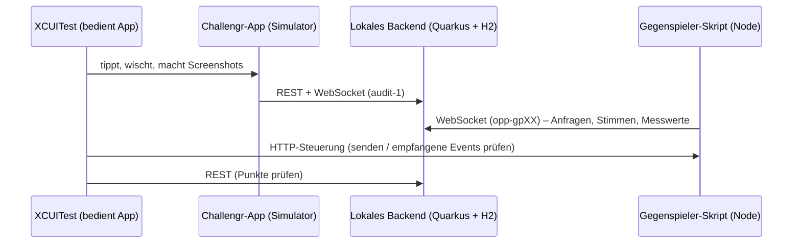

Jeder Test hat einen eigenen Gegenspieler (`opp-gp01` …), damit die Regel „eine offene Anfrage pro Spielerpaar“ die Tests nicht gegenseitig beeinflusst.

---

## 1. Erststart und Navigation

### GP01 – Onboarding beim ersten Start · **PASS**
- **Voraussetzung:** `hasSeenOnboarding = NO`
- **Schritte:** App starten → 3 Seiten mit „WEITER“ durchblättern → „LOS GEHT'S“
- **Erwartet:** drei erklärende Seiten, danach die Karte
- **Beobachtet:** wie erwartet (17 s)

| Seite 1 | Seite 2 | Seite 3 | Karte |
|---|---|---|---|
| 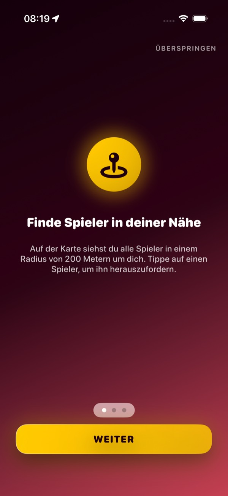 | 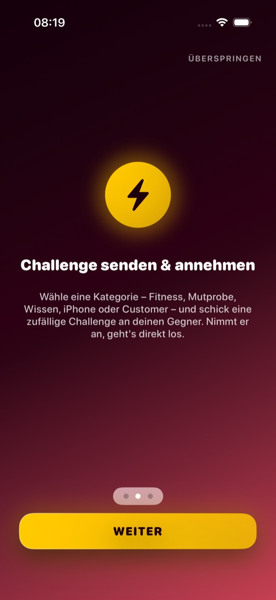 | 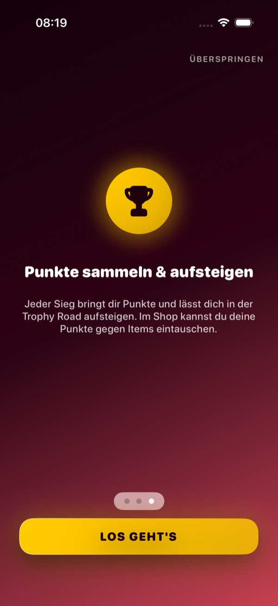 | 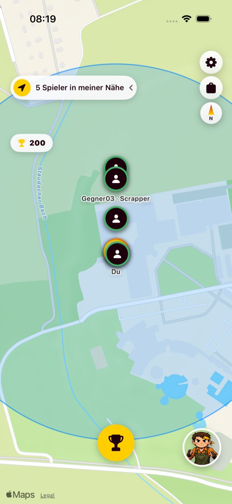 |

### GP02 – Onboarding überspringen wird gespeichert · **PASS**
„ÜBERSPRINGEN“ → Karte; zweiter Start **ohne** Override → kein Onboarding (`onboardingShownOnSecondLaunch = false`).

### GP03 – Karte zeigt Spieler und Punkte · **PASS**
Zähler „5 Spieler in meiner Nähe“, Pin des Gegners, Punkte-Chip 200.

---

## 2. Herausfordern (ausgehend)

### GP04 – Spieler-Popup → Kategorie-Dialog · **PASS**
Kategorien mit Anzahl: Fitness 5, Mutprobe 5, Wissen 5, iPhone 7, **Customer 0 (korrekt deaktiviert)**.

| Spieler-Popup | Kategorien | Zufalls-Challenge |
|---|---|---|
| 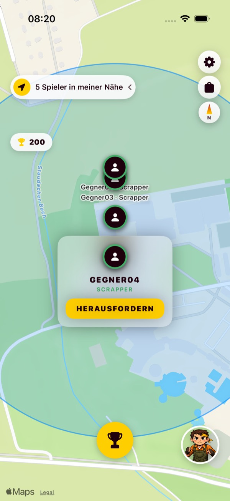 | 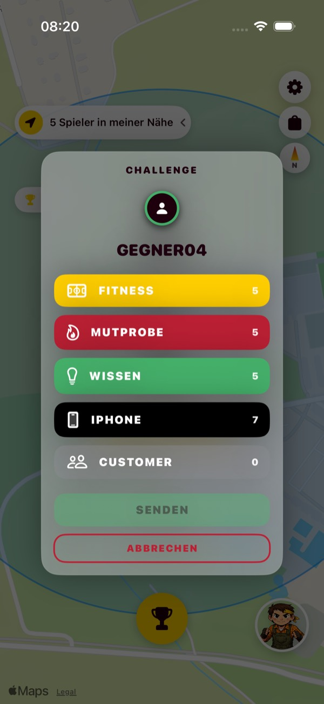 | 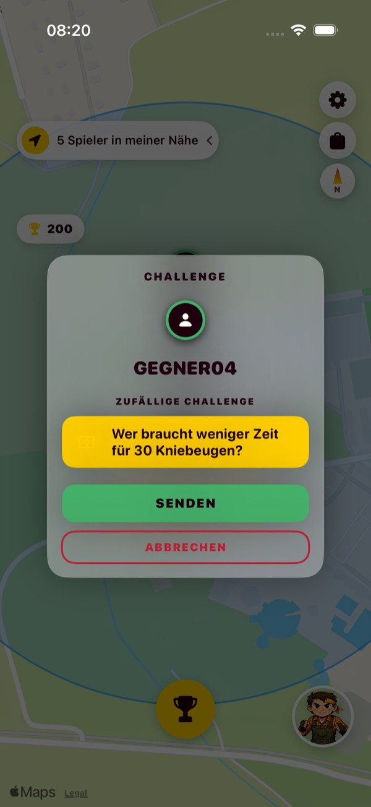 |

### GP05 – Gesendeter Text = empfangener Text · **PASS**
Der ursprüngliche Hauptfehler („Spieler 2 bekommt eine andere Challenge“) ist **behoben**:
- App zeigt: „Wer hält länger einen Plank (Unterarmstütz)?“
- Gegner empfängt: „Wer hält länger einen Plank (Unterarmstütz)?“

### GP06 – Eigene Anfrage abbrechen · **PASS**
„ABBRECHEN“ → Gegner erhält `battle-updated CANCELLED`, Overlay verschwindet.

### GP07 – Gegner lehnt ab · **PASS**
Banner „Challenge wurde abgelehnt“.

### GP08 – Doppel-Tap auf SENDEN · **PASS** (Teil a)
Genau **1** Anfrage beim Gegner. Teil b (zweite Anfrage an denselben Spieler) lässt sich über die UI nicht auslösen, weil das Overlay „ANFRAGE GESENDET“ die Karte blockiert. Das ist korrektes Verhalten, der Fall wurde durch FU01 ersetzt.

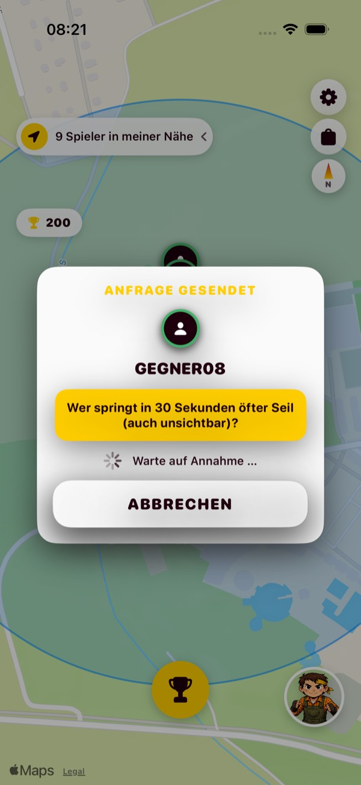

---

## 3. Eingehende Challenges und Battle-Abläufe

### GP09 – Eingehende Challenge ablehnen · **PASS**
Popup zeigt den richtigen Text. „ABLEHNEN“ → Gegner erhält `DECLINED`.

### GP10 – Normales Battle mit Abstimmung und Sieg · **PASS**
- **Schritte:** Gegner fordert heraus → ANNEHMEN → GESCHAFFT → im Voting eigenen Namen wählen → Gegner stimmt ebenfalls für `audit-1`
- **Erwartet:** Ergebnis-Wartescreen, Sieg-Screen, Punkte steigen, Chip auf der Karte aktualisiert
- **Beobachtet:** 200 → **230** Punkte, Chip zeigt 230

| Battle | Voting | Ergebnis wird berechnet | Sieg |
|---|---|---|---|
|  |  | 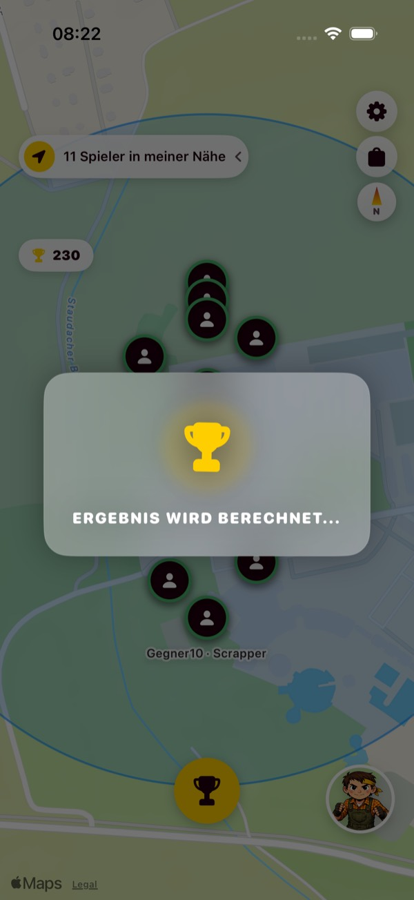 |  |

> Visueller Befund im Battle-Screen: Karten und „AUFGEBEN“ laufen rechts über den Bildschirmrand → **BUG-08**.

### GP11 – Aufgeben · **PASS**
Niederlage-Screen, Punkte 230 → **210**.

### GP12 – Konflikt (unterschiedliche Stimmen) · **PASS**
Niederlage-Screen mit Trash-Talk „Keine Einigung – Konflikt-Penalty.“ Beide sehen „Niederlage“, obwohl es ein Unentschieden/Konflikt ist (UX-Hinweis, siehe USABILITY_UX_REPORT).

### GP13 – Wissen: richtige Antwort · **PASS**
Frage mit 4 Antworten, richtige Antwort gewählt → Sieg.

### GP14 – Wissen: beide antworten falsch · **FAIL → BUG-03**
- **Schritte:** Wissens-Battle annehmen → falsche Antwort bestätigen → Gegner antwortet ebenfalls falsch → 20 s warten
- **Erwartet:** Unentschieden oder eine zweite Chance, auf jeden Fall ein Ende
- **Beobachtet:** kein Ergebnis (`resolvedAfter20s = false`), **keine erneute Antwort möglich** (`canAnswerAgain = false`), dauerhaft „Antwort gesendet – warte auf Ergebnis …“. Der Button sieht weiter aktiv aus. Das Battle endet erst nach 10 min durch den Server (`ABANDONED`).


### GP15 – Sprint · **PASS**
Countdown → Lauf → Gegner meldet 12,5 m, App (Simulator ohne Bewegung) 0,0 m → Niederlage mit **Vergleichswerten**.

| Countdown | Ergebnis mit Messwerten |
|---|---|
| 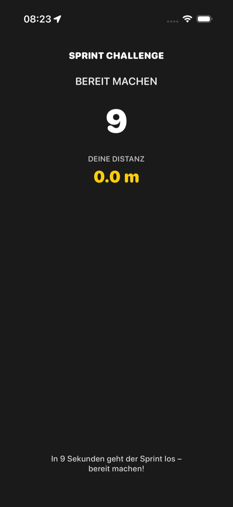 |  |

### GP16 – Anfrage läuft ab · **PASS**
Nach **64 s** `EXPIRED`, Popup verschwindet selbstständig. Es gibt allerdings keinen sichtbaren Countdown (UX-Hinweis).

### GP17 – Anfrage eines Dritten während laufendem Battle · **FAIL → BUG-02**
- **Schritte:** Gegner A fordert heraus → ANNEHMEN (Battle 14 läuft) → Spieler B fordert während des Battles heraus (Battle 15) → AUFGEBEN
- **Erwartet:** Battle 14 endet, A gewinnt, beide bekommen ein Ergebnis
- **Beobachtet:** Die App schickt `DONE_SURRENDER` für **Battle 15**. Das Backend ignoriert es („läuft nicht (REQUESTED)“). A bekommt kein Ergebnis, die App hängt in „Ergebnis wird berechnet“ **über** dem Popup von B.
- **Log** (`logs/06_GP17_backend_evidence.txt`):
  ```
  battle created: id=14 … from=opp-gp17a, to=audit-1
  message from player audit-1: {"battleId":14,…"status":"ACCEPTED"}
  battle created: id=15 … from=opp-gp17b, to=audit-1
  message from player audit-1: {"status":"DONE_SURRENDER",…"battleId":15}
  update-battle-status DONE_SURRENDER ignoriert: Battle 15 läuft nicht (REQUESTED)
  ```

| Battle nach Anfrage von B | Nach „Aufgeben“ |
|---|---|
| 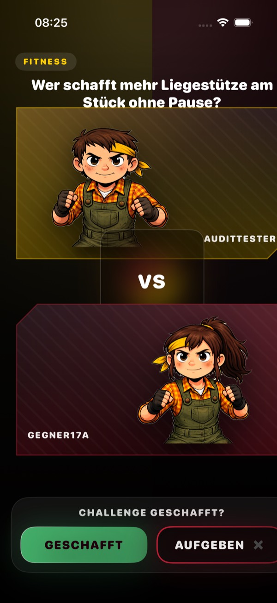 |  |

---

## 4. Hintergrund, Unterbrechung, Neustart

### GP18 – Hintergrund und zurück · **PASS**
Offenes Challenge-Popup bleibt nach 5 s Homescreen erhalten.

### GP19 – Challenge kommt im Hintergrund an · **PASS**
Die lokale Mitteilung **„Neue Challenge!“** erscheint auf dem Homescreen, nach der Rückkehr ist das Popup da. Auf dem Screenshot fehlt das **App-Icon** (Platzhalter) → **BUG-07**.


### FU01 – Neustart während eigener offener Anfrage · **FAIL → BUG-05**
| Schritt | Ergebnis |
|---|---|
| Anfrage senden, App beenden, neu starten | Warte-Overlay **weg** (FAIL) |
| Denselben Spieler erneut herausfordern | Server lehnt ab, Banner „offene Challenge“ (PASS) |
| Gegner nimmt die **alte** Anfrage an | App **bleibt auf der Karte**, der Gegner ist allein im Battle (FAIL) |


### FU02 – Neustart mitten im Battle · **teilweise FAIL → BUG-06**
Nach dem Neustart zeigt die App die Karte statt des Battles (FAIL). Gibt der Gegner danach auf, kommt der Sieg-Screen trotzdem (PASS). Die Ergebnis-Zuordnung über die Spieler-ID funktioniert also.

---

## 5. Nicht getestete Spielmechaniken

| Mechanik | Status | Grund |
|---|---|---|
| Liegestütze (ARKit Face Tracking) | BLOCKED | kein TrueDepth im Simulator |
| Kamera-Farbchallenge | BLOCKED | keine Kamera im Simulator |
| Kompass | BLOCKED | kein Kompass im Simulator |
| Schrei (Mikrofon), Shake, Check-In-Spot | NOT TESTED | Sensorwerte im Simulator nicht reproduzierbar steuerbar |
| Echter Keycloak-Login | BLOCKED | kein Testkonto; Produktivsystem wurde nicht berührt |

**Aussagekraft:** Die Kernschleife (Anfrage → Annahme → Battle → Ergebnis → Punkte) ist für normale Battles, Wissen und Sprint **real belegt**. Die übrigen sechs Sensor-Challenges brauchen einen Test auf echten Geräten.
