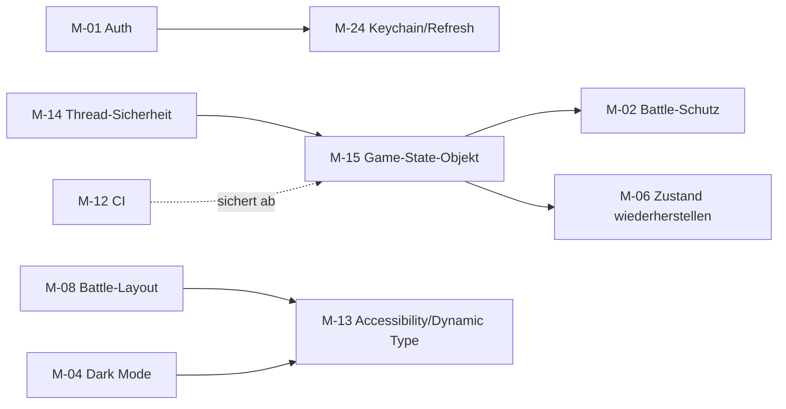

# IMPROVEMENT ROADMAP – Challengr iOS (Phase 8)

> Grundlage sind die bestätigten Befunde aus [BUG_REPORT](BUG_REPORT.md), [SWIFT_CODE_AUDIT](SWIFT_CODE_AUDIT.md), [USABILITY_UX_REPORT](USABILITY_UX_REPORT.md) und [PERFORMANCE_REPORT](PERFORMANCE_REPORT.md).
>
> **Aufwand:**
> - **XS** < 2 h
> - **S** ≤ 1 Tag
> - **M** 2–4 Tage
> - **L** 1–2 Wochen (für ein Schulteam mit 1–2 Entwicklern)
>
> Empfohlen werden nur Änderungen, die zur tatsächlichen Plattform (iOS 17.6+, SwiftUI, Quarkus) passen. **Kein Architekturwechsel**: Die bestehende SwiftUI-Struktur wird schrittweise entzerrt, nicht ersetzt.

## Überblick

| Prio | ID | Maßnahme | Behebt | Aufwand |
|---|---|---|---|---|
| **P0** | M-01 | Authentifizierung durchgängig | BUG-01, S-02, S-04 | L |
| **P0** | M-02 | Laufendes Battle gegen neue Anfragen schützen | BUG-02 | S |
| **P0** | M-03 | Wissens-Battle immer zu Ende bringen | BUG-03, BUG-20 | S |
| **P0** | M-04 | Dark-Mode-Farben reparieren | BUG-04 | XS |
| **P0** | M-05 | App-Icon hinterlegen | BUG-07 | XS |
| **P1** | M-06 | Spielzustand nach Neustart wiederherstellen | BUG-05, BUG-06 | M |
| **P1** | M-07 | Logout räumt Socket und Standort auf | BUG-09 | XS |
| **P1** | M-08 | Battle-Layout für alle iPhones | BUG-08 | S |
| **P1** | M-09 | Fehler- und Offline-Anzeige | BUG-11, CA-23–25 | S |
| **P1** | M-10 | Freunde-Seite ohne Standort | BUG-13 | XS |
| **P1** | M-11 | Plausibilitätsprüfung der Messwerte | S-07 | S |
| **P1** | M-12 | CI mit echten Tests | CI-Platzhalter | S |
| **P2** | M-13 | Accessibility-Grundlagen | BUG-10 | M |
| **P2** | M-14 | Thread-Sicherheit `GameSocketService` | CA-19, CA-20 | M |
| **P2** | M-15 | Spielzustand aus `MapView` herauslösen | CA-01, CA-04, CA-10 | L |
| **P2** | M-16 | Standort-Updates drosseln, ein `LocationHelper` | CA-13, P-01 | S |
| **P2** | M-17 | Polling reduzieren, stabile Pin-IDs | CA-06, CA-12, P-02–P-04 | S |
| **P2** | M-18 | Karten-Interaktion (Popup, Clustering) | BUG-12, UX-01, UX-02 | M |
| **P2** | M-19 | Challenge-Typ als Datenfeld | CA-14 | S |
| **P2** | M-20 | Spielregeln sichtbar machen | UX-09–UX-11, BUG-15, BUG-19 | M |
| **P3** | M-21 | iPad/Querformat entscheiden | BUG-16 | S |
| **P3** | M-22 | Aufräumen (toter Code, Assets, Musik-Schalter, Tippfehler) | CA-11, CA-17, BUG-17, BUG-18 | S |
| **P3** | M-23 | Logging mit `os.Logger` | CA-15 | S |
| **P3** | M-24 | Token im Keychain + Refresh | S-09 | S |
| **P3** | M-25 | Veraltete APIs und Swift-6-Vorbereitung | Build-Warnungen | S |
| **P3** | M-26 | Texte in einen String Catalog | UX-20 | M |

> M-02 ist auch **ohne** M-15 als kleiner Fix machbar und sollte sofort passieren. M-15 macht den Schutz dauerhaft und testbar.

---

## P0 – Sicherheit und grundlegende Blocker

### M-01 · Authentifizierung durchgängig
- **Befund:** Die App sendet ihr Token nie (`KeycloakAuthService.swift:119`). Das Backend verlangt nirgends eine Anmeldung, Admin/Ban ist `@PermitAll` (`AdminBanResource.java:22`). Lokal bestätigt: fremde Spieler änderbar, alle Positionen lesbar.
- **Begründung:** Jeder mit der URL kann Spieler manipulieren, bannen, Positionen Minderjähriger auslesen und Antworten abrufen.
- **Umsetzung:**
  1. App: zentraler `APIClient`, der `Authorization: Bearer` setzt. WebSocket-Handshake mit Token.
  2. Backend: `quarkus.http.auth.permission.api.paths=/api/*,/ws/*` → `authenticated`; Player-ID aus `JsonWebToken.getSubject()` statt aus Pfad/Body/Header.
  3. `@RolesAllowed("admin")` für `/api/admin/*`; Dashboard sendet Token.
  4. `GET /api/players` entfernen bzw. auf Admin beschränken.
- **Nutzen:** schließt die kritischste Lücke. **Risiko:** Dashboard und App müssen gleichzeitig umgestellt werden. Keycloak-Client braucht die Audience für das Backend.
- **Abhängigkeiten:** danach M-24.
- **Akzeptanzkriterien:** Anfrage ohne Token → 401; mit Token eines anderen Spielers `PUT /api/players/{fremd}` → 403; `/api/admin/*` ohne Admin-Rolle → 403; WebSocket ohne gültiges Token wird geschlossen.
- **Regressionstests:** Backend-Tests für 401/403 je Ressource; der bestehende `GameSocketTest` mit Token; UI-Test GP10 weiterhin grün.

### M-02 · Laufendes Battle gegen neue Anfragen schützen
- **Befund:** `MapView.swift:1286` überschreibt `currentBattleId` im Battle (GP17).
- **Umsetzung:** In `onChallengeReceived`: Ist `activeFullScreen != .none` oder `activeBattleInfo != nil`, die neue Anfrage **nicht** übernehmen, sondern `DECLINED` senden. Backend zusätzlich: `createRequestedBattle` lehnt ab, wenn der Empfänger ein laufendes Battle hat („Spieler ist gerade im Battle“).
- **Nutzen:** Kein Battle hängt mehr durch Dritte. **Risiko:** gering.
- **Akzeptanzkriterien:** GP17 grün – A erhält `battle-result`, B erhält `battle-rejected`/`DECLINED`.
- **Regressionstests:** UI-Test GP17; Backend-Test „Anfrage an Spieler im Battle wird abgelehnt“.

### M-03 · Wissens-Battle immer zu Ende bringen
- **Befund:** GP14. Beide falsch → kein Ergebnis. Der Client sperrt nach einer Antwort.
- **Umsetzung:** Backend speichert die erste Antwort je Spieler (weitere werden ignoriert); beide falsch → Unentschieden; 30-s-Zeitlimit (wie `resultWait`) → Unentschieden bzw. wer richtig war gewinnt. Client: „Falsch!“-Rückmeldung, Countdown, gesperrten Button grau darstellen.
- **Akzeptanzkriterien:** Beide falsch → beide sehen innerhalb von 2 s „Unentschieden“; keine Antwort → nach 30 s Ergebnis; eine zweite Antwort desselben Spielers per WebSocket ändert nichts.
- **Regressionstests:** UI-Test GP14 (jetzt mit Erwartung „Unentschieden“); Backend-Test „Durchprobieren nicht möglich“.

### M-04 · Dark-Mode-Farben reparieren
- **Befund:** Alle 5 Markenfarben sind im Dark Mode Weiß (`Assets.xcassets/*.colorset`).
- **Umsetzung:** Dark-Varianten entfernen (gleiche Farbe in beiden Modi) **oder** App vorerst auf hell fixieren (`UIUserInterfaceStyle = Light`).
- **Akzeptanzkriterien:** Screenshots der Layout-Tests im Dark Mode (Karte, Popup, Battle, Ergebnis, Shop) ohne Weiß-auf-Weiß; Accessibility-Audit ohne neue Kontrastbefunde.
- **Regressionstest:** `LayoutTests` mit `simctl ui appearance dark`.

### M-05 · App-Icon hinterlegen
- **Befund:** `AppIcon.appiconset` leer (GP19-Screenshot).
- **Akzeptanzkriterien:** Icon auf Homescreen und in Mitteilungen sichtbar; Archivierung ohne Icon-Warnung.

## P1 – Wesentliche Funktions- und UX-Fehler

### M-06 · Spielzustand nach Neustart wiederherstellen
- **Befund:** FU01/FU02. Der Zustand liegt nur in `@State`.
- **Umsetzung:** Backend `GET /api/players/me/battles/active` (offene eigene Anfragen, eingehende Anfragen, laufendes Battle). Alternativ beim WebSocket-Connect auch dem **Absender** seine offenen Anfragen und beiden Spielern das laufende Battle schicken. App baut `outgoingBattleInfo` bzw. das aktive Battle daraus wieder auf.
- **Abhängigkeit:** leichter nach M-15.
- **Akzeptanzkriterien:** FU01 und FU02 grün (Warte-Overlay und Battle nach Neustart sichtbar, Annahme führt ins Battle).
- **Regressionstests:** UI-Tests FU01/FU02; Backend-Test für den neuen Endpunkt.

### M-07 · Logout räumt auf
- **Umsetzung:** `socket.disconnect()` und Stopp der Standort-Updates in `MapView.onDisappear` bzw. über einen Logout-Callback.
- **Akzeptanzkriterien:** Nach Logout meldet das Backend `No active WebSocket session` für den Spieler (Test SC02b).

### M-08 · Battle-Layout für alle iPhones
- **Befund:** `BattleView.swift:297-321`, feste Breiten ≈ 394 pt.
- **Umsetzung:** Breite aus `GeometryReader` ableiten (z. B. Avatar = 55 % der Breite), `minWidth` beim Namen entfernen, Titel über den Karten mit reserviertem Platz.
- **Akzeptanzkriterien:** Layout-Screenshots auf iPhone 16e, 17 Pro, 17 Pro Max ohne abgeschnittene Elemente; der Accessibility-Audit meldet kein „Text clipped“.

### M-09 · Fehler- und Offline-Anzeige
- **Umsetzung:** HTTP-Status in allen Services prüfen (`CA-23`), Fehler an die UI melden; Verbindungs-Banner bei WebSocket-Reconnect; `ownPoints` optional („–“ statt „0“); `preloadChallenges` mit erneutem Versuch.
- **Akzeptanzkriterien:** SC07: Banner „Keine Verbindung“, keine „0 Punkte“; nach Wiederverbindung automatisch aktualisiert.

### M-10 · Freunde-Seite ohne Standort
- **Umsetzung:** `ProfileContainerView.swift:64` → `FriendsListView` immer zeigen, `currentCoordinate` optional übergeben.
- **Akzeptanzkriterien:** Freundesliste und QR-Einladung auch ohne Standortfreigabe nutzbar.

### M-11 · Plausibilitätsprüfung der Messwerte
- **Umsetzung:** Backend-Grenzen je Challenge (z. B. Sprint ≤ 150 m / 15 s, Liegestütze ≤ 80 / 30 s, Lautstärke im dB-Bereich des Messgeräts, Kompass 0–180°). Unplausible Werte → Wert verwerfen, Konflikt.
- **Akzeptanzkriterien:** Backend-Tests „unplausibler Wert gewinnt nicht“.

### M-12 · CI mit echten Tests
- **Umsetzung:** GitHub-Actions-Workflow: Backend `./mvnw test` (ubuntu, Java 21); iOS `xcodebuild test` auf einem `macos-latest`-Runner (Unit-Tests, optional die UI-Test-Suite aus diesem Audit gegen ein im Job gestartetes Backend).
- **Akzeptanzkriterien:** Pull Requests zeigen Teststatus; ein roter Test blockiert den Merge.

## P2 – Architektur, Performance, kleinere UX-Mängel

### M-13 · Accessibility-Grundlagen
- **Umsetzung:**
  - `accessibilityLabel` für alle Icon-Buttons und Pins
  - `.accessibilityHidden` für Dekoration
  - `.accessibilityAddTraits(.isModal)` für Overlays
  - Schriftgrößen über `Font.TextStyle` bzw. `@ScaledMetric`
  - Kontraste ≥ 4,5:1
  - Reduce Motion für Konfetti und Wackeln
- **Akzeptanzkriterien:** Der Accessibility-Audit aus diesem Audit liefert 0 „Label not human-readable“, 0 „Contrast failed“ auf den Hauptscreens, „Dynamic Type“-Befunde halbiert.

### M-14 · Thread-Sicherheit `GameSocketService`
- **Umsetzung:** Alle URLSession-Callbacks auf den Main Actor zurückführen (`Task { @MainActor in … }`) oder den Service als `actor` mit `@MainActor`-Veröffentlichung. Timer-Closures in den Challenge-Views gleich behandeln.
- **Akzeptanzkriterien:** Build mit `SWIFT_STRICT_CONCURRENCY=complete` ohne Meldungen in `GameSocketService`, `LoudnessChallengeView`, `KnowledgeBattleView`.

### M-15 · Spielzustand aus `MapView` herauslösen
- **Umsetzung:** `@Observable final class BattleSession` (iOS 17 verfügbar) mit klaren Zuständen (`idle`, `outgoing(id)`, `incoming(id)`, `active(id, kind)`, `awaitingResult(id)`, `result(data)`) und Übergangsfunktionen. `MapView` rendert nur noch. Der Socket wird über ein Protokoll injiziert.
- **Nutzen:** Die Fehler BUG-02/05/06 wären als Unit-Tests abbildbar. `MapView` schrumpft deutlich.
- **Risiko:** größere Umstellung, deshalb schrittweise und abgesichert durch die UI-Tests dieses Audits.
- **Akzeptanzkriterien:** Unit-Tests für alle Übergänge (Anfrage während Battle, Ablauf, Abbruch, Neustart); Coverage für `BattleSession` ≥ 80 %.

### M-16 · Standort-Updates drosseln
- **Umsetzung:** `distanceFilter = 10`, Genauigkeit `kCLLocationAccuracyNearestTenMeters` für die Karte (Best nur für Sprint/Check-In). Ein gemeinsamer `LocationHelper` per Environment; PUT gedrosselt (z. B. höchstens alle 5 s).
- **Akzeptanzkriterien:** Bei stehendem Gerät keine PUTs; Sprint/Check-In weiterhin genau.

### M-17 · Polling reduzieren, stabile Pin-IDs
- **Umsetzung:** `PlayerAnnotation.id = playerId`; Freundes-Polling durch WebSocket-Events ersetzen (ein Mechanismus statt drei); doppelten `loadAll` entfernen.
- **Akzeptanzkriterien:** Pins behalten ihre Identität (Popup-Toggle funktioniert nach Refresh); pro Öffnen der Freunde-Seite genau ein `loadAll`.

### M-18 · Karten-Interaktion
- **Umsetzung:** Popup schließt bei Tippen auf die Karte; bei mehreren Spielern auf engem Raum Clustering bzw. eine Liste „Spieler in der Nähe“ zum Antippen.
- **Akzeptanzkriterien:** SC06 grün; in einer Gruppe von 10 Spielern ist jeder gezielt antippbar.

### M-19 · Challenge-Typ als Datenfeld
- **Umsetzung:** Spalte `type` (`GENERIC`, `SPRINT`, `CHECKIN`, …) in `challenges`, Ausgabe im DTO; `BattleScreen.forChallenge` nutzt den Typ, der Text dient nur noch als Rückfall.
- **Akzeptanzkriterien:** Umbenennen eines Challenge-Texts im Dashboard ändert die Ansicht nicht.

### M-20 · Spielregeln sichtbar machen
- **Umsetzung:** Countdown im Anfrage-Popup (60 s) und im Warte-Screen (45 s); eigener Screen für „Unentschieden/Konflikt“; Gegner-Avatar und -Name im Payload; kurze Regel-Erklärung beim ersten Battle.
- **Akzeptanzkriterien:** Hypothesen H2, H4 und H6 aus dem UX-Bericht im Nutzertest bestätigt bzw. entkräftet.

## P3 – Optional und langfristig

| ID | Maßnahme | Akzeptanzkriterium |
|---|---|---|
| M-21 | iPad/Querformat: iPhone auf Portrait sperren; iPad entweder anpassen oder aus `TARGETED_DEVICE_FAMILY` entfernen | keine unangepassten Layouts mehr |
| M-22 | Toter Code in `MapView` entfernen, ungenutzte Assets (≈ 8 MB) und Sounds, Musik-Schalter entfernen oder umsetzen, Rangname korrigieren | App-Größe sinkt, keine ungenutzten Symbole |
| M-23 | `print` durch `os.Logger` mit Kategorien ersetzen, WebSocket-Inhalte nur im Debug-Build loggen | keine Spielnachrichten im Release-Log |
| M-24 | Tokens im Keychain speichern, Refresh-Token nutzen (nach M-01) | kein Login bei jedem App-Start |
| M-25 | Veraltete APIs ersetzen (`onChange`, `videoRotationAngle`, `plotFrame`), `LoudnessPhase` außerhalb des Main Actors | 0 Build-Warnungen |
| M-26 | Texte in einen String Catalog (`.xcstrings`) übernehmen, einheitliche Begriffe (Punkte vs. Trophäen) | Sprachmix beseitigt |

## Empfohlene Reihenfolge (Sprints à 2 Wochen)

| Sprint | Inhalt | Ziel |
|---|---|---|
| 1 | M-02, M-03, M-04, M-05, M-07, M-10 | Schultest-tauglich: keine hängenden Battles, lesbar, Icon |
| 2 | M-01 (App + Backend + Dashboard), M-12 | sicher, automatisiert getestet |
| 3 | M-06, M-08, M-09, M-11 | robust gegenüber Neustart, Offline und Schummeln |
| 4 | M-14, M-15 (schrittweise), M-16, M-17 | wartbar, sparsam |
| 5+ | M-13, M-18–M-20, P3 | zugänglich, verständlich, aufgeräumt |
