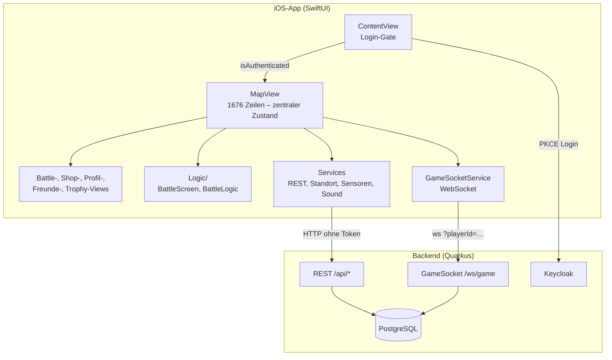
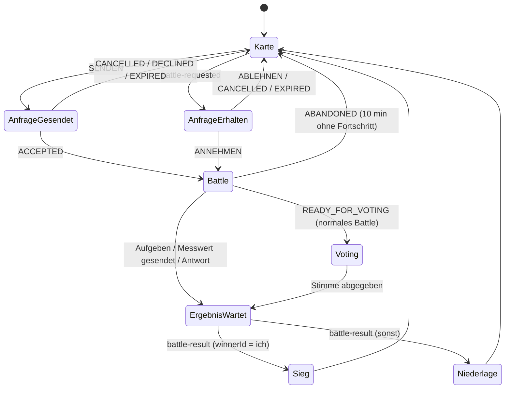

# SYSTEM MAP – Challengr iOS (Phase 1)

> Stand: Repository-Commit `8eccb7f` („Biiiiggg Commit“), untersucht am 30.09.2026.
> Gegenstand: **`Swift/Challengr`** (Haupt-App). `Swift Kopie/` wurde gemäß Auftrag ignoriert.
> Alle Angaben unten stammen aus dem Quellcode, der Projektdatei und echten Builds. Nichts davon ist aus Namen geraten.

---

## 1. Projekt auf einen Blick

| Merkmal | Befund | Quelle |
|---|---|---|
| Plattform | iOS (iPhone + iPad, `TARGETED_DEVICE_FAMILY = "1,2"`) | `project.pbxproj` |
| Deployment Target | iOS **17.6** | `IPHONEOS_DEPLOYMENT_TARGET` |
| Xcode / SDK im Audit | Xcode 26.0.1 (17A400), iOS-26.0-Simulator (einzige installierte Laufzeit) | `xcodebuild -version`, `simctl` |
| Sprache | Swift 5 Language Mode (`SWIFT_VERSION = 5.0`), `SWIFT_DEFAULT_ACTOR_ISOLATION = MainActor`, `SWIFT_APPROACHABLE_CONCURRENCY = YES` | `project.pbxproj` |
| UI-Framework | **SwiftUI** (36 Dateien), punktuell UIKit (Kamera-Preview, Share-Sheet, Haptik) | Imports |
| Game Engine | **keine** (kein SpriteKit/SceneKit); das „Spiel“ ist eine standortbasierte Multiplayer-App mit Sensor-Minispielen | Imports |
| Architektur | View-zentriert (SwiftUI-State in Views), ein ViewModel (`FriendsViewModel`), Service-Klassen, neue reine Logik-Schicht `Logic/` | Dateistruktur |
| Backend | Quarkus (Java 21) + PostgreSQL, REST + WebSocket, Keycloak (OIDC) | `Backend/`, `BackendConfig` |
| Abhängigkeiten | **keine** Drittanbieter-Pakete (kein SPM, kein CocoaPods) | `project.pbxproj` |
| Code-Umfang | 54 Swift-Dateien in der App (≈ 12 000 Zeilen), 6 Test-Dateien | `wc -l` |
| Größte Datei | `Views/MapView.swift` – **1 676 Zeilen** | `wc -l` |
| Tests | 47 Unit-Tests (XCTest), **0 UI-Tests** im Repo | Testlauf |
| CI | `.github/workflows/ci.yaml` ist ein Platzhalter (`java Hello.java` in `code/backend`), baut/testet das Projekt **nicht** | Datei |

## 2. Targets, Schemes, Konfigurationen

| Target | Typ | Bundle-ID | Anmerkung |
|---|---|---|---|
| `Challengr` | App | `at.htl.leonding.challengr.binder` | Info.plist wird generiert (`GENERATE_INFOPLIST_FILE`), Ordner als *File System Synchronized Group* |
| `ChallengrTests` | Unit-Test-Bundle (hosted) | `…binder.tests` | 6 Testdateien, 47 Tests |

- **Scheme:** `Challengr` (shared), Test-Action → `ChallengrTests`.
- **Build-Konfigurationen:** Debug / Release (Standard). Keine eigenen `.xcconfig`, keine Umgebungs-Varianten (Dev/Prod) – die Backend-URL ist fest codiert (`Model.swift:78`).
- **Berechtigungen (Info.plist-Keys):** Kamera, Mikrofon, Standort (When-in-Use + Always-Text), URL-Scheme `challengr://`, eigener Dokumenttyp `challengrfriend` (Freundes-Einladung).
- **Orientierungen:** iPhone Portrait + Landscape links/rechts (Portrait ist doppelt eingetragen), iPad alle.

## 3. Schichten und Verzeichnisse

```
Swift/Challengr/Challengr/
├── ChallengrApp.swift          @main → ContentView
├── ContentView.swift           Login-Gate → MapView (+ Onboarding als fullScreenCover)
├── Model.swift                 DTOs + BackendConfig (URL)
├── BattleResultModels.swift    Ergebnis-Modell für Sieg/Niederlage
├── Logic/                      reine, testbare Spielregeln (neu, 100 % abgedeckt)
│   ├── BattleScreen.swift      Challenge → Battle-Ansicht
│   └── BattleLogic.swift       Ergebnis-Zuordnung, Abstimmung, Challenge-Auflösung, Kategorie-Filter
├── Services/                   Netzwerk, Sensorik, Sound, Mitteilungen
│   ├── KeycloakAuthService     OIDC/PKCE-Login (ASWebAuthenticationSession)
│   ├── PlayerLocationService   REST /api/players …
│   ├── ChallengesService, ShopService, FriendsService, RankService (in TrophyRoadView)
│   ├── LocationHelper          CLLocationManager → PUT Position
│   ├── MotionManager, SoundMeter   Sensoren
│   ├── SoundManager, NotificationManager
│   ├── FriendsInboxStore       Freundschaftsanfragen (Banner/Badge)
│   └── FriendInviteTransfer    QR/AirDrop-Einladungen
├── ViewModels/FriendsViewModel.swift
├── WebSocket/GameSocketService.swift   Echtzeit-Protokoll (595 Zeilen)
├── Views/                      31 SwiftUI-Views (Screens + Komponenten)
├── Sounds/                     62 MP3 (9,4 MB)
└── Assets.xcassets             Farben, Avatare, Shop-Bilder (3,9 MB)
```

### Architektur-Diagramm



## 4. State Management und Datenfluss

- **Zentraler Spielzustand lebt als `@State` in `MapView`** (≈ 50 State-Properties): eingehende/ausgehende Challenge, `currentBattleId`, `activeBattleInfo`, `activeFullScreen` (none/battle/voting/win/lose), `activeOverlay`, Punkte, Profil-Daten, Karten-Annotationen usw.
- Tuples statt Typen für Spielzustand (`incomingChallenge`, `outgoingBattleInfo`, `activeBattleInfo`).
- **Ereignisfluss:** Server → `GameSocketService.handleIncoming` → Closure-Callbacks (`onChallengeReceived`, `onBattleAccepted`, `onBattleResult` …) → werden in `MapView.setupSocket()` gesetzt und verändern `@State`.
- **Kein Game Loop / Rendering-Loop:** zeitabhängige Abläufe laufen über `Timer.scheduledTimer` (Sprint, Shake, Loudness, Push-ups) bzw. `Task.sleep`-Schleifen (Kompass, Polling).
- **Polling:** Nähe-Spieler alle 4 s (`MapView`), Freunde alle 30 s + eingehende Anfragen alle 5 s (`FriendsListView`), Freundes-Badge alle 60 s (`FriendsInboxStore`), dazu WebSocket-Events.
- **Persistenz lokal:** nur `UserDefaults`/`@AppStorage` (Onboarding gesehen, Sound, Musik, Mitteilungen, Avatar-Auswahl, Player-ID-Cache). **Kein Keychain**, Tokens werden nicht gespeichert → nach jedem App-Start neuer Login.
- **Persistenz serverseitig:** Punkte, Battles, Freunde, Shop-Besitz (PostgreSQL). Spielstand = Serverzustand.

### Battle-Zustandsautomat (Client-Sicht)



## 5. Screens und Navigation (tatsächlich implementiert)

| Screen | Datei | Erreichbar über |
|---|---|---|
| Login | `LoginView` | App-Start ohne Session |
| Onboarding (3 Seiten) | `OnboardingView` | erster Start nach Login (`hasSeenOnboarding`) |
| Karte (Hauptscreen) | `MapView` | nach Login |
| Spieler-Popup, Challenge-Dialog (Kategorien) | `MapView`, `ChallengeDialogView` | Tipp auf Spieler-Pin |
| Anfrage gesendet / Anfrage erhalten / Ergebnis wird berechnet / Info-Banner | Overlays in `MapView`, `ResultPendingCard` | Battle-Ablauf |
| Normales Battle | `BattleView` | Challenge ohne Spezial-Typ |
| Wissens-Battle | `KnowledgeBattleView` | Kategorie „Wissen“ |
| Sprint, Check-In-Spot, Kompass, Shake, Lautstärke, Kamera (Farbe), Liegestütze | `*ChallengeView`, `CheckInSpotView` | Kategorie „iPhone“ (Erkennung über Stichwort im Text) |
| Abstimmung | `BattleVotingView` | nach „Geschafft“ |
| Sieg / Niederlage | `BattleWinView`, `BattleLoseView` (+ `ConfettiView`) | `battle-result` |
| Einstellungen | `SettingsView` (Sheet) | Zahnrad |
| Shop | `ShopView` (Sheet) | Tasche oder Punkte-Chip |
| Profil + Freunde (2 Seiten, Swipe) | `ProfileContainerView` → `UserProfileView`, `FriendsListView` | Avatar unten rechts |
| Charakter bearbeiten | `CharacterEditorSheet` | Profil → BEARBEITEN |
| Freund hinzufügen (QR zeigen/scannen, AirDrop) | `AddFriendSheet`, `FriendInviteQRView`, `FriendInviteScannerView`, `ShareSheet` | Freunde-Seite |
| Freundesprofil | `FriendProfileView` | Freundesliste |
| Trophy Road | `TrophyRoadView` (Sheet) | Pokal-Button unten |
| Challenge-Katalog / Detail | `ChallengeView`, `ChallengeDetailView` | Trophy Road → Link |

Toter / unerreichbarer Code in `MapView`: `battleScreen`, `challengeSheet` (`showChallengeView` wird nie `true`), `locationButton`, `vibrate()`, `opponentVote`; `myVote` wird nur geschrieben.

## 6. Game Modes (Battle-Typen)

| Typ | Ergebnisbestimmung | Sensorik |
|---|---|---|
| Normales Battle (Fitness, Mutprobe, Customer, unbekannte iPhone-Texte) | beide stimmen ab; gleich → Sieger, verschieden → Konflikt | – |
| Wissen | erste richtige Antwort (Server prüft) | – |
| Sprint | größere Distanz in 15 s | GPS (eigener `LocationHelper`) |
| Check-In-Spot | wer zuerst ≤ 30 m am Zielpunkt ist | GPS |
| Kompass | kleinste Winkelabweichung | Kompass (`CLHeading`) |
| Shake | mehr Schüttler in 10 s | CoreMotion |
| Lautstärke („Schrei“) | lautester Wert in 10 s | Mikrofon |
| Kamera | Übereinstimmung mit Zufallsfarbe | Kamera + CoreImage |
| Liegestütze | Wiederholungen in 30 s | **ARKit-Face-Tracking** (TrueDepth) |

Punkte: Sieger +30 / Verlierer −20, ±5 % je Rangunterschied; Konflikt-Strafe ab dem 3. Konflikt in Folge (Backend `BattleService`).

## 7. Backend-Integration (App-Sicht)

**REST** (`BackendConfig.apiURL`, alle Aufrufe **ohne Authorization-Header**):
`/api/players` (POST/PUT/GET, `nearby`, `{id}/points|streak|stats|history|battles|profile|loudness-best`), `/api/challenges/{kategorie}`, `/api/challenges/id/{id}`, `/api/ranks`, `/api/friends/*` (requests, list, gifts), `/api/shop/*`.

**WebSocket** `wss://…/ws/game?playerId=<id>` – Client → Server: `create-battle`, `update-battle-status`, `battle-vote`, `battle-answer`, `sprint|loudness|compass|camera|shake|pushup-result`. Server → Client: `battle-requested`, `battle-created`, `battle-updated`, `battle-rejected`, `battle-pending`, `battle-question`, `battle-result`, `friend-request-*`, `friend-removed`, `player-position-updated`, `error`.

**Login:** Keycloak Authorization Code + PKCE über `ASWebAuthenticationSession`; Player-ID = Keycloak-`sub`. Das Access-Token wird nach dem Login **nicht weiterverwendet**.

## 8. Assets, Audio, Lokalisierung

- **Audio:** 62 MP3 (9,4 MB), 16 davon über `SoundEffect` benutzt; Schalter „Soundeffekte“ wirkt. Schalter **„Hintergrundmusik“ ohne Funktion** (es gibt keine Musik).
- **Bilder:** Avatare (playerBoy/Girl je ≈ 1 MB PNG), Shop-Bilder in zwei Varianten (`Coin` **und** `Coin 1` …) – nur die „ 1“-Varianten werden vom Backend referenziert; `basic` (0,9 MB JPG) und `character.usdc` sind unreferenziert.
- **Schrift:** ausschließlich `.system(size:)` mit festen Größen → **kein Dynamic Type**.
- **Lokalisierung:** keine `.strings`/`.xcstrings`; Texte hart codiert, überwiegend Deutsch, teils Englisch („TAP TO VOTE“, Rang-Namen).
- **Dark Mode:** keine gezielte Unterstützung; eigene Farben, Systemlisten (Einstellungen) folgen dem System.

## 9. Tests, Qualitätssicherung, CI

| Bereich | Stand |
|---|---|
| Unit-Tests App | 47 (Logik, Nachrichten-Parsing, Modelle, Einstellungen) – grün |
| Code-Abdeckung App | **3,9 %** gesamt; `Logic/` 100 %, `GameSocketService` 36 %, alle Screens ≈ 0 % |
| UI-Tests | keine im Repo (für diesen Audit in einem isolierten Klon erstellt, siehe BUILD_AND_TEST_RESULTS) |
| Backend-Tests | 75 (JUnit + WebSocket-E2E mit H2) – grün |
| Statische Analyse | keine Tools im Projekt (kein SwiftLint); Compiler mit `SWIFT_STRICT_CONCURRENCY=complete` ergibt 58 Meldungen |
| CI | Platzhalter-Workflow, führt keine Tests aus |
